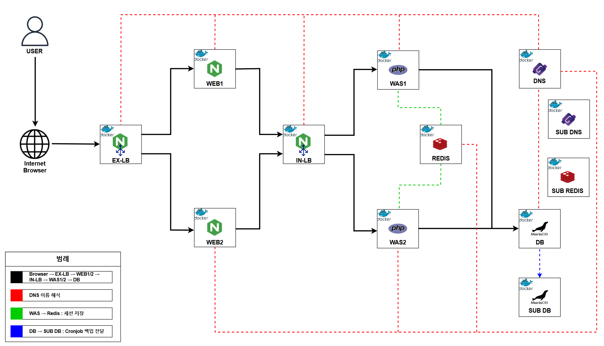

# 아키텍처


# 3Tier Architecture (Vagrant)
- 사용자가 회원가입 및 로그인 하는 폼 구현
- Nginx LBs(Internal LB, External LB), Nginx web tier, PHP/Apache app tier, MariaDB, Redis, CoreDNS and automated DB backups
- IaC: Vagrant

# 선행조건
- Oracle VM VirtualBox를 설치하셔야 합니다.
- Vagrant를 설치하셔야 합니다.

# 사용방법
- Vagrantfile 파일을 up만 하면 됩니다.

# Windows (PowerShell)
```powershell
# 레포지토리 클론
git clone https://github.com/woongaga/3tier-ha-lab.git
cd 3tier-ha-lab
```

# Linux
```bash
# 레포지토리 클론
git clone https://github.com/woongaga/3tier-ha-lab.git
cd 3tier-ha-lab
```

# 배포 및 삭제
```bash
# 의존성을 위해 dbdns, dbdns-backup 우선순위 배포
vagrant up dbdns dbdns-backup lb-internal webwas1 webwas2 lb-external

# 삭제/정리
vagrant destroy -f
vagrant global-status --prune

# powershell
Remove-Item -Recurse -Force .vagrant, keys

# Linux
rm -rf .vagrant keys
```

# 생성물
- 6대 VM (사설망 192.168.56.0/24)
  - 192.168.56.103 lb-external (Nginx)
  - 192.168.56.104 webwas1 (Web+WAS)
  - 192.168.56.105 webwas2 (Web+WAS)
  - 192.168.56.106 lb-internal (Nginx)
  - 192.168.56.107 dbdns (MariaDB/Redis/CoreDNS, 백업 생성 + 108으로 push)
  - 192.168.56.108 dbdns-backup (MariaDB/Redis/CoreDNS, 백업 수신)

# 검증
- 접속할 PC의 이더넷 어댑터 옵션에서 DNS 서버 주소를 기본 설정 DNS 서버는 192.168.56.107, 보조 DNS 서버는 192.168.56.108로 설정합니다.
- 만약 다른 작업 중이라면, /etc/hosts에 도메인만 추가해서 접속할 수 있습니다.
  - Windows: 관리자 메모장으로 C:\Windows\System32\drivers\etc\hosts 열어 192.168.56.103 lb-external.3tier.test 한 줄 추가
  - Linux: echo "192.168.56.103 lb-external.3tier.test" | sudo tee -a /etc/hosts
- 브라우저에서 `http://lb-external.3tier.test`로 접속
- 회원가입 및 로그인합니다.
- Ctrl + F5를 누르며 LB의 정상 작동을 확인합니다.
- web 및 was 컨테이너를 멈춰도 서비스가 정상적으로 동작합니다.
- dbdns 노드에서 매일 03:00 자동 백업 → 로컬 저장 후 dbdns-backup 노드로 백업본을 scp합니다.

# 장애 복구 검증
```bash
# 1) dbdns 노드에서 cron job 대신 수동 백업을 실시합니다.
sudo /usr/local/bin/mariadb_backup.sh

# 2) dbdns 노드(물리서버)가 장애가 났다는 가정으로 dbdns의 mariadb, redis, coredns 컨테이너를 stop시킵니다.
docker stop mariadb redis coredns

# 3) dbdns-backup 노드에서 복사된 백업 파일을 확인합니다.
ls -lh /opt/backups/mysql

# 4) 수동으로 현재 DB 삭제 및 선택한 DB로 복구합니다.
docker exec mariadb mariadb -uroot -pRootPwd! -e \
  "DROP DATABASE IF EXISTS appdb; CREATE DATABASE appdb;"
sudo zcat "/opt/backups/mysql/<복사된 백업 파일명>" | docker exec -i mariadb mariadb -uroot -pRootPwd! appdb

# 5) 현재 회원가입한 계정을 확인합니다.
docker exec mariadb mariadb -uroot -pRootPwd! -e \
  "SELECT * FROM appdb.users\G"

# 6) db / redis A 레코드를 192.168.56.108로 변경합니다.
sudo sed -i -E 's/^(db[[:space:]]+IN[[:space:]]+A[[:space:]]+)192\.168\.56\.107/\1 192.168.56.108/' "/opt/coredns/3tier.test.zone"
sudo sed -i -E 's/^(redis[[:space:]]+IN[[:space:]]+A[[:space:]]+)192\.168\.56\.107/\1 192.168.56.108/' "/opt/coredns/3tier.test.zone"

# 7) SOA 시리얼(괄호 뒤 숫자) 현재 시각으로 갱신합니다.
sudo sed -i -E "s/\(\s*[0-9]+\s/\( $(date +%Y%m%d%H) /" "/opt/coredns/3tier.test.zone"

# 8) CoreDNS를 재시작합니다.
sudo docker restart coredns
```

# 유의할 점
- Host PC의 RAM: ≥ 8 GB 권장 (VM 6대 × 1GB)
- Host PC의 디스크 용량: ≥ 28 GB 필수
- 본 프로젝트의 DB/계정/키 설정은 데모를 위한 값입니다. 실제 운영 환경에는 강력한 비밀번호/방화벽/네트워크 분리/권한 최소화를 적용하세요.
